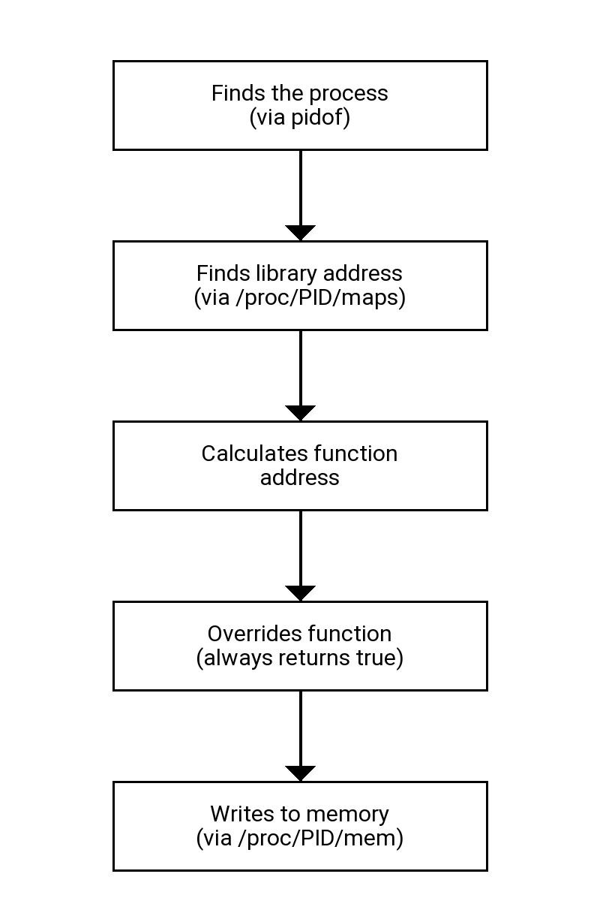
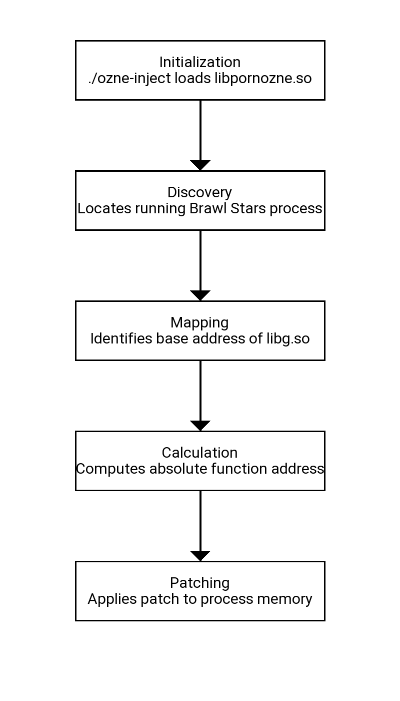

# Brawl Stars Reverse Engineering (BSRE)

---
OzneInjector is a project that modifies process memory at runtime, allowing. Memory manipulation is done through the `/proc/[PID]/mem` system for direct writing to the target process's memory.

---

## Disclaimer

This project is intended for educational and research purposes only. The author does not endorse, encourage, or take responsibility for any misuse or violation of laws or terms of service related to the content or code provided here.

By using this project, you agree that you are solely responsible for ensuring compliance with applicable laws and agreements. Any unauthorized use of this project is strictly prohibited and done at your own risk.

---

## Use this software responsibly and ethically.

---

## Overview
---

## Functionality

- **Chromatic Name: Activates chromatic name.**

## Configuration
- `Config.hpp`: Injection settings (package, library, AppName)

---
## Operation



### Execution Flow



---
## Requirements

### System
- Android with root access
- Target process (BS) running

### Build Dependencies
- CMake 3.10+
- Ninja build system
- Clang++ compiler
- GNU/Linux headers

---
## Installation

### Manual Build
```bash
mkdir build && cd build
cmake -G Ninja -DCMAKE_CXX_COMPILER=clang++ ..
ninja
```

### Auto Build
```bash
./build.sh / sh/bash build.sh
```

----
## Usage within the project
```
su
./ozne-inject
```

### Output 
```
    / _  |   Ozne 1.2 - toolkit
   | (_| |
    > _  |   Commands:
   /_/ |_|     exit/quit -> Exit
   . . . .    more information with @hwhsysiaka
   . . . .

Process `com.supercell.brawlstars` found with PID: 12345
[+] chromatic name active
```

---
## Required

- Requires root access
- Works only while the process is running
- Specific to the current version of Brawl Stars (with BSD's libg.so, but can be used on the original library)

## Troubleshooting

### "Write failed"
- Check root permissions
- SELinux might be blocking the operation

## Development

### Project Structure
```
.
├── CMakeLists.txt
├── README.md
├── build.sh
├── images
│   ├── execution_flow.png
│   └── operation.png
├── include
│   ├── config
│   │   └── Config.hpp
│   ├── functions
│   │   └── gfx
│   │       └── ChromaticNamePatcher.hpp
│   └── utils
│       ├── Memory.hpp
│       └── SysInfo.hpp
├── main.cpp
└── src
    ├── core
    │   └── Hook.cpp
    ├── functions
    │   └── gfx
    │       └── ChromaticNamePatcher.cpp
    └── utils
        ├── Memory.cpp
        └── SysInfo.cpp
```

---

This project is intended exclusively for educational and research purposes in reverse engineering.

---
## Credits:
@hwhsysiaka